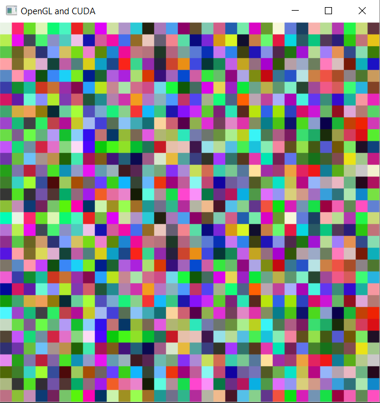

# Cuda + OpenGL (with CMake)
This project shows how to integrate CUDA and OpenGL. Generating the Makefile with CMake

## Expected Output

After building and running the project (see below). You should see this:



## Dependencies

You need to install:

* CUDA SDK
* OpenGL
* CMake 3.0+

## How to build (Windows)

To build on windows. Open the command line (or use the cmake gui)


* Check your Visual Studio version and change it if needed on the last step
* The CUDA SDK may be installed as 64bit version. If so, you need to use the `Win64` on the last command, otherwise you can omit it. If you omit it on 64bit versions you won't have access to libraries like: CURand or CUBLAS

```
    mkdir build
    cd build
    cmake .. -G "Visual Studio 12 2013 Win64"
```

Open the project in Visual Studio.


## How to build (MacOS and Linux)

This step couldn't be tested, if you test it email me or create an issue saying
if it works or not.

```
    mkdir build
    cd build
    cmake ..
    make
```


## Contributors

* Matheus Faria (matheus.sousa.faria@gmail.com)
